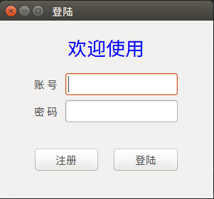
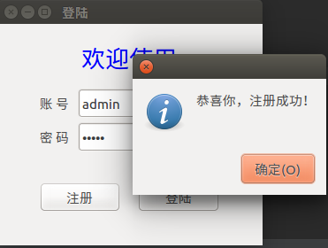
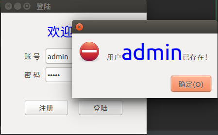
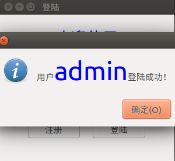
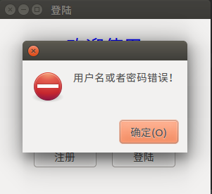

# python-learn
学习python过程中的一些小练习

##任务三 ： 使用PyGTK与数据库实现用户登陆注册

###学习PyGTK
 * 首先，找资料。发现一个较好的教程——“PyGTK教程（中文版）”。
 * 另外，对于一些GTK库函数的文档可以从<https://developer.gnome.org/pygtk/stable/index.html>找到。
 * 还有PyGTK官方教程地址：<http://www.pygtk.org/pygtk2tutorial/>
 
 
 ###完成效果
 **主界面**
 
 
 
 **注册成功** ： 使用“admin”，“123”注册
 
 
 
 **注册失败** ： 再次使用“admin”， “1234”注册
 
 
 
 **登陆成功** ： 使用“admin”， “123”登陆
 
 
 
 **登陆失败** ： 使用“admin”， “1234124”登陆
 
 